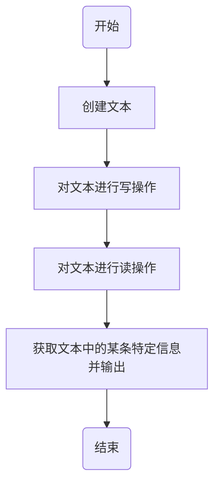

<font size = 5><center>C++小任务记录</center></font>

[TOC]

# １ 使用Ｃ＋＋程序读写文本
## 1.1 使用Ｃ＋＋程序读写ASCI码
### 1.1.1 程序实现
（1）实验资料
```
实验环境：
  软件环境：Ubuntu16.04.5 TLS + ROS[Kinetic]
  硬件环境：3.0G

实验工具：
  软件工具：
  　　编译器：GCC
  函 数 库：
```
（2）实验原理
&#8195;&#8195;使用C++程序对文件的操作，进而得出相关对文本内容的提取，来获得文本中的有效信息；
（3）实验步骤
&#8195;&#8195;对文本的读写，操作流程如下：



&#8195;&#8195;对于被读写的文本创建方式存在两种，一种为直接进行手动创建，另一种为使用程序进行创建，为了操作的方便与增加随机个数据，这里使用程序的创建方式进行，同时，后续的文件读写操作，均使用函数方式进行。

- **对数字的获取与读写**

&#8195;&#8195;这里模拟传感器生成的数据，对文件中的数据进行读出，并对这些数据进行整理，打印输出，表示成功对文件中的数据进行读取；

情景模拟：
&#8195;&#8195;假设传感器检测到一系列物体的信息之后，生成一些列的点的坐标信息，这些信息包括点生成的时间、以及x、y、z方向上的坐标信息、目标的体积信息等，该数据由一组没有整理的数所组成，下形式：
```
[时间] [x轴起始点] [x轴终止点] [y轴起始点] [y轴终止点] [z轴起始点] [z轴终止点]
```
&#8195;&#8195;因此，需要将其按照以下的格式进行打印输出，其中点的坐标取用x、y、z方向上的起始坐标作为点的位置，而体积的长宽高则由各轴的终止点减去起始点所得到的距离。
```
时间：00:00　位置：(x, y, z) 体积：l*d*h cm^3
```
&#8195;&#8195;在测试１，Test One的程序中对汉字的存储有所影响，这里将不采用汉字的方式进行存储，因此以下述的格式进行打印与存储。
```
time:00:00 Point:(x,y,z) Volume:l*d*h cm^3
```
<2019年07月03日12:00>

- **对字符串的获取与读写**

- **数字与字符串混合读写**

#### 1.1.1.1 对数字的获取与读写实现
（1）操作过程
```
/*#####################################
## 测试１：文件读写初步
## 目的：检查如何对文件进行读写
#####################################*/

/*## Test One ##*/
#include <iostream>
#include <stdlib.h>
#include <fstream>

using namespace std;
int main()
{
  //创建存储结构
  int a[10];
  //创建文件，并检查文件创建是否成功
  ofstream outfile("f1.txt", ios::out);
  if(!outfile)
  {
    cerr<<"open error!"<<endl;
    exit(1);
  }
  //向屏幕进行操作提示
  cout << "enter 10 integer numbers:" << endl;
  //向存储结构中存入数据
  for(int i = 0; i < 10; i++)
  {
    cin >> a[i];
    outfile << a[i] << " ";
  }
  //关闭文件
  outfile.close();
  return 0;
}
/*#####################################
运行时间：2019年07月03日11:22
程序运行：
---------------------------------------
$ g++ file_operation.cpp -o file_operation
$ ./file_operation
  enter 10 integer numbers:
  1 3 5 7 9 2 4 6 8 10
=>f1.txt content:
  1 3 5 7 9 2 4 6 8 10
$ ./file_operation
  enter 10 integer numbers:
  哈 哈 哈 ha ha ha js fa je ls
=>f1.txt content:
  0 32767 -615892282 32665 1 0 0 0 0 0
---------------------------------------
结果分析:
    在程序中所生成的存储结构为整型数组，因此在输入
其他字符时，便以其二进制编码的形式进行存储，在进行输
入时，应考虑其存储的格式，由此类推，当存储结构为字符
型数组时文本文件中应该保存的是字符
#####################################*/

/*------------------------------------*/

/*## Test Two ##*/
#include <iostream>
#include <stdlib.h>
#include <fstream>

using namespace std;
int main()
{
  //创建存储结构
  char a[10];
  //创建文件，并检查文件创建是否成功
  ofstream outfile("f1.txt", ios::out);
  if(!outfile)
  {
    cerr<<"open error!"<<endl;
    exit(1);
  }
  //向屏幕进行操作提示
  cout << "enter 10 chars:" << endl;
  //向存储结构中存入数据
  for(int i = 0; i < 10; i++)
  {
    cin >> a[i];
    outfile << a[i] << " ";
  }
  //关闭文件
  outfile.close();
  return 0;
}
/*#####################################
运行时间：2019年07月03日11:22
程序运行：
---------------------------------------
$ g++ file_operation.cpp -o file_operation
$ ./file_operation
  enter 10 chars:
  a f e d s c e s w w
=>f1.txt content:
  a f e d s c e s w w
---------------------------------------
结果分析:
    程序的运行结果同预期的一致，当前是否能够对
汉字进行存储有待验证，一般一个汉字需要用两个位
进行表示，因此在输入五个字符　应该能够进行存储，
但是在进行存储的过程中注意每个汉字的数据不能造成
覆盖，因此需要每次递加２。
#####################################*/

/*## Test Three ##*/
#include <iostream>
#include <stdlib.h>
#include <fstream>

using namespace std;
int main()
{
  //创建存储结构
  char a[10];
  //创建文件，并检查文件创建是否成功
  ofstream outfile("f1.txt", ios::out);
  if(!outfile)
  {
    cerr<<"open error!"<<endl;
    exit(1);
  }
  //向屏幕进行操作提示
  cout << "请输入5个汉字（每个汉字中间空一格）:" << endl;
  //向存储结构中存入数据
  for(int i = 0; i < 10; i=i+2)
  {
    cin >> a[i];
    outfile << a[i] << " ";
  }
  //关闭文件
  outfile.close();
  return 0;
}
/*#####################################
运行时间：2019年07月03日11:43
程序运行：
---------------------------------------
$ g++ file_operation.cpp -o file_operation
$ ./file_operation
  请输入5个汉字（每个汉字中间空一格）:
  哈 哈 汗 达 啦
=>f1.txt content:
  æ ± — è ¾ [notepad++]
  � � � � � [atom UTF-8]
  ⃦₱ₗ⃨₾ [gedit]
---------------------------------------
结果分析:
    由此可以得出，在输入的过程中对汉字的编发存在
一定上的要求，导致在数据的存储方式上存在乱码的情况，
以此，后续在对数据进行操作的过程中，注意使用数字与
英文的方式对文件进行读写的操作
#####################################*/


/*############################################
##############################################
############################################*/

/*#####################################
## 测试2：文件读写的定位
## 目的：文件读写的有序化
## 内容：换行、空格
#####################################*/

    根据对前面程序的运行与修改，要对文本进行换行操作，
则在文件输出的文件流应写成如下形式：
    outfile << a[i] << '\n';
    要实现空格，则输入的内容应改成如下形式：
    outfile << a[i] << " ";
    这里确定障碍物的结构为：
    struct object{
      time;
      int detect[6];
      object * next;
    }
    因此要写入文件的格式：
    outfile << object.time << " " << object.detect[0] << " " << object.detect[1] << " " << object.detect[2] << " " << object.detect[3] << " " << object.detect[4] << " " << object.detect[5] << endl;
    读取存储的结构为
    struct object_pose{
      time;
      int point[3];
      int volume[3];
      object_pose * next;
    }
    打印的格式为：
    outfile << object.time << " " << object.point[0] << " " << object.point[1] << " " << object.point[2] << " " << object.volum[0] << " " << object.volum[1] << " " << object.volum[2] << '\n';

/*#####################################
## 测试3：实现对文件信息的读写
## 目的：文件读写的有序化
## 内容：单独使用函数对文件进行创建与读取
#####################################*/

/*### Test One ###*/
#include <iostream>
#include <stdlib.h>
#include <fstream>

using namespace std;

struct object{
  //time;
  int detect[6];
};
/*
struct object_pose{
  time;
  int point[3];
  int volume[3];
}
*/
//产生随机数
int Random(int start, int end)
{
  int dis = end - start;
  return rand() % dis + start;
}

//创建文件
void create_file()
{
  int i;
  //创建存储结构
  char a[10];
  //创建文件，并检查文件创建是否成功
  ofstream outfile("detectfile.txt", ios::out);
  if(!outfile)
  {
    cerr<<"open error!"<<endl;
    exit(1);
  }

  //随机生成点的个数
  i = Random(0,10);
  object detect_now[i];

  //向存储结构中存入数据
  for(int j = 0; j < i; j++)
  {
    //detect_now.timer = ;
    for(int k = 0; k < 6; k=k+2)
    {
      detect_now[j].detect[k] = Random(1,100);
      detect_now[j].detect[k+1] = Random(detect_now[j].detect[k],100);
    }
  }

  for(int j = 0; j < i; j++)
  {
    outfile << " " << detect_now[j].detect[0] << " " << detect_now[j].detect[1] << " " << detect_now[j].detect[2] << " " << detect_now[j].detect[3] << " " << detect_now[j].detect[4] << " " << detect_now[j].detect[5] << '\n';
  }
  //关闭文件
  outfile.close();
}
/*#########
函数运行结果：
  44 53 80 93 71 71
  40 49 2 60 41 66
  26 67 5 50 55 62
运行分析：
　【运行正常】
#########*/

int main()
{
  create_file();
  return 0;
}


```
（2）实现代码
```ruby{.line-numbers}
```
（3）实验总结


##### 1.1.1.1.1 <Struct_optimization>
（1）优化方案
```
```
（2）实现代码
```ruby{.line-numbers}
```
（3）实验总结

###### 1.1.1.1.1.1 <Precision_optimization>
（1）优化方案
```
```
（2）实现代码
```ruby{.line-numbers}
```
（3）实验总结


# 2 编写寻找最近点算法
## 2.1 点到点之间最短距离算法实现
### 2.1.1 实验设计
（1）实验资料
```
实验环境：
  软件环境：Ubuntu16.04.5 TLS + ROS[Kinetic]
  硬件环境：3.0G

实验工具：
  软件工具：
  　　编译器：GCC
```
（2）实验原理
&#8195;&#8195;为了贴近实际的应用场景，这里将基于上一项实验的基本框架进行设计与开发，这里将上一步文件中所记录的点进行保存，然后选择目标点位置，计算出

（3）实验步骤

#### 2.1.1.1 <Function_realization>
（1）操作过程
```
```
（2）实现代码
```ruby{.line-numbers}
```
（3）实验总结


##### 2.1.1.1.1 <Struct_optimization>
（1）优化方案
```
```
（2）实现代码
```ruby{.line-numbers}
```
（3）实验总结

###### 2.1.1.1.1.1 <Precision_optimization>
（1）优化方案
```
```
（2）实现代码
```ruby{.line-numbers}
```
（3）实验总结

## 2.2 点到线之间最短距离算法实现
