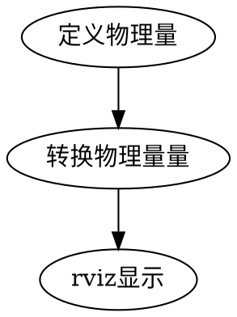

# 1 创建
## 1.1 矩阵
&#8195;&#8195;对矩阵的定义主要是使用Eigen下的Matrix类型进行的，由于数组有着众多的形态，这也使得数组的定义有所不同：
```
方阵的定义
  Eigen::Matrixnt <var>;
  //在Matrix后的n、t分别表示矩阵的规模和数据的形式：
　 n     含义
  ２　　二维方阵
  ３　　三维方阵
  ４　　四维方阵
  Ｘ　　自定义矩阵规模

  ｔ　　　含义
  d    数据为double类型
  f    数据为float类型

示例：
三维方阵的定义
  Eigen::Matrix3d A;
  A << 1, 0, 0,
       0, 1, 0,
       0, 0, 1;

自定义矩阵的定义与赋值
  Eigen::MatrixXd A(3,1);
  A << 5,
       2,
       8;
```

# 2 运算

# 额外
旋转矩阵、旋转向量、四元数之间的转换分析

包含头文件
```
#include <iostream>
#include <cmath>
#include <eigen3/Eigen/Core>
// Eigen 几何模块
#include <eigen3/Eigen/Geometry>
```
旋转矩阵
```
定义
    Eigen::Matrix3d R = Eigen::Matrix3d::Identity();
输出
    std::cout << R << std::endl;
转换
    转四元数
    q = Eigen::Quaterniond(R);

```
其中Matrix3d中ｄ表示数据类型位双精度，并非指维度

旋转向量
```
定义
    Eigen::AngleAxisd v(<angle>, <vector>);
输出：
    旋转角度
      std::cout << v.angle()*(180/M_PI) << std::endl;
    旋转轴
      std::cout << v.axis().transpose()<<std::endl;
    向量坐标矩阵
      std::cout << v.matrix() << std::endl;
转换：
    转旋转矩阵
      R=v.toRotationMatrix();
    转四元数
      q = Eigen::Quaterniond(v);
```
四元数
```
定义：
    Eigen::Quaterniond q;
输出：
    (x, y, z, w)
      std::cout << q.coeffs() << std::endl;
    各个量单独输出
      std::cout << q.x() << q.y() << q.z() << q.w() << std::endl;
转换：
    转旋转矩阵
      R = Eigen::Matrix3d(q);
    转旋转向量
      v = Eigen::AngleAxisd(q);
```
坐标点
```
定义
    Matrix3f I Matrix3f::Identity(3,1);
    A << 5, 8, 3;
```
