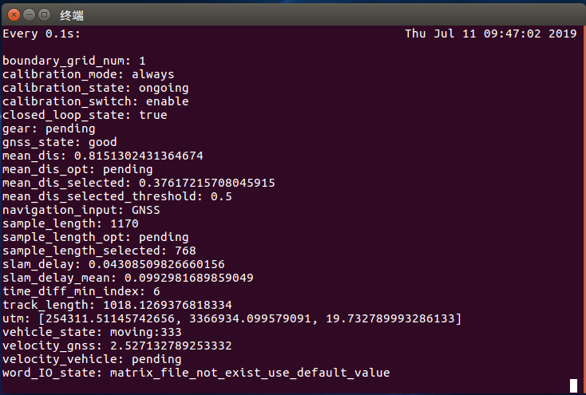
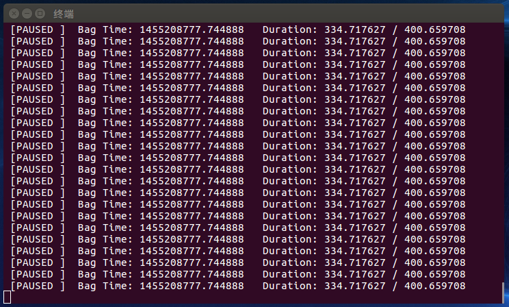
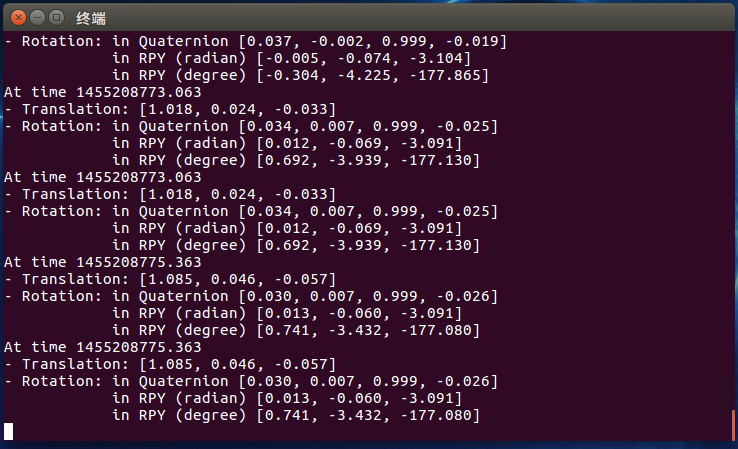
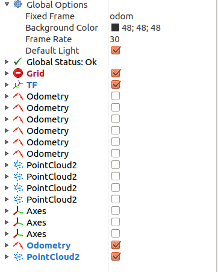
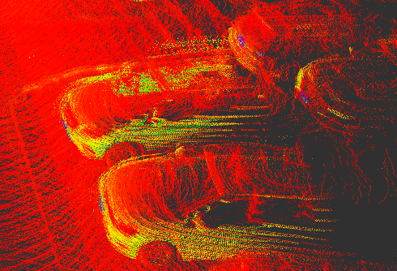

# 标定与测试记录
&#8195;&#8195;为了能够给传感器之间的数据融合给出条件，这里需要对传感器作出标定，在本次进行标定的工作主要是对主文件夹下的test/ws_one_key_slam_executable/ws_one_key_slam下的编译后的二进制工程文件作为标定与测试的样板。这里首先说明整个工程的文件结构：
```
ws_one_key_slam
  |_slam_autorun_one_key.sh    《《＝＝Start file //shell脚本文件，作为整个工程的启动文件
  |_localization
    |_package.xml
    |_bin             //不同节点的二进制文件
    | |_fusion_node   
    | |_gnss_node
    | |_laserMapping     //激光雷达地图
    | |_laserOdometry
    | |_localization_node　　　　//惯导定位节点
    | |_multiScanRegistration
    | |_process_vehicle_velocity　　　//车辆运行速度节点
    | |_transformMaintenance
    | |_zone_reporter
    |_lib
    | |_libfusion_base.so
    | |_libgnss_driver.so
    | |_liblocalization.so
    | |_libfusion_kf.so
    | |_libgnss_nodelet.so
    | |_libslam.so
    | |_libfusion_nodelet.so
    | |_libgnss_parser.so
    | |_libgnss_connect.so
    | |_liblocalization_nodelet.so
    |_slam_config
      |_localization_node    
      | |_launch
      |   |_localization_bag.launch    //惯导的launch文件
      |_slam_velodyne
      | |_launch
      | | |_publish_base_link2velodyne.launch    //标定数据填入位置
      | | |_slam_velodyne.launch
      | |_rviz_cfg
      | | |_base_link2velodyne.rviz  //标定测试的rviz配置文件
      | | |_slam_velodyne.rviz      //rviz配置文件
      | |_slam_autorun
      |   |_data
      |   | |_calibration_result.txt
      |   | |_readme.txt  
      |   | |_tform_L.txt  
      |   | |_tform_X.txt  
      |   | |_tform_Z.txt
      |   |_monitor
      |   | |_slam_monitor_dump.sh
      |   |_play_bag.sh
      |   |_slam_autorun_catkin.sh
      |   |_slam_autorun_one_key.sh
      |_vehicle_velocity_parser
      | |_launch
      |   |_vehicle_velocity_parser.launch
      |_zone_management
        |_launch
        | |_zone_management.launch
        |_gnss_bad_quadrilateral_list.txt
        |_gnss_blind_zone_list.txt
        |_gnss_bad_section_list.txt

/home/zm/temple/exam/all2circle.bag  //数据包位置
```

&#8195;&#8195;在进行标定的过程中，主要是从数据包获取场景的数据，通过数据包中的数据来算出惯导与激光雷达的坐标转换关系，以此来获取转移矩阵，实现对管道与激光雷达的标定。
&#8195;&#8195;在对传感器进行标定前，首先需要运行主节点，以便能够支持整个工程的运行，即随起一个终端，在终端下运行roscore即可；
```
roscore
```
&#8195;&#8195;要对整个工程进行运行，主要是通过脚本文件来进行的。即在slam_autorun_one_key.sh脚本文件所在的目录下，开启终端，并将脚本文件拖到终端下进行运行。拖动后出现命令行如下：
```
$ '<main_directory>/test/ws_one_key_slam_executable/ws_one_key_slam/slam_autorun_one_key.sh'
```
&#8195;&#8195;而对传感器进行标定与标定结果进行测试，所执行的相关内容都有所不同：
```
#!/bin/bash

export LD_LIBRARY_PATH=$PWD/lib:$LD_LIBRARY_PATH
export LD_LIBRARY_PATH=$PWD/localization/lib:$LD_LIBRARY_PATH
#package
export ROS_PACKAGE_PATH=$PWD/localization:$ROS_PACKAGE_PATH

echo "set path finished"

echo "change file owner"
chmod 777 -R $PWD/*

echo "start ros node"


echo "set slam path:"
rosparam set slam_path "$(cd $(dirname $0);pwd)/data/"
echo $slam_path

echo "start slam_monitor_dump.sh"
gnome-terminal -x bash -c    './localization/slam_config/slam_velodyne/slam_autorun/monitor/slam_monitor_dump.sh'
sleep 1

rosparam set calibration_result_path "./localization/slam_config/slam_velodyne/slam_autorun/data/calibration_result.txt"
echo "The optimal calibration parameters:pending" > $(rosparam get calibration_result_path)
gnome-terminal -x bash -c "watch -n 1 cat $(rosparam get calibration_result_path)"


echo "launch gnss"
 gnome-terminal -x bash -c "roslaunch ./localization/slam_config/localization_node/launch/localization_bag.launch"
sleep 1

# echo "launch for test"
#  gnome-terminal -x bash -c "roslaunch ./localization/slam_config/slam_velodyne/launch/publish_base_link2velodyne.launch"

echo "launch slam"
  gnome-terminal -x bash -c  "roslaunch  ./localization/slam_config/slam_velodyne/launch/slam_velodyne.launch "
sleep 3

echo "launch zone_management"
gnome-terminal -x bash -c  "roslaunch  ./localization/slam_config/zone_management/launch/zone_management.launch"
sleep 1

echo "launch vehicle_velocity_parser"
gnome-terminal -x bash -c  "roslaunch  ./localization/slam_config/vehicle_velocity_parser/launch/vehicle_velocity_parser.launch"
sleep 1

# 播放数据包
echo "play rosbag"
gnome-terminal -x bash -c  "rosbag play /home/zm/temple/exam/all2circle.bag --clock --topics /velodyne_points_with_gps /gnss/raw "

# 打印标定结果消息
echo "play some data"
gnome-terminal -x bash -c  "rosrun tf tf_echo base_link velodyne"
# sleep 3
```
&#8195;&#8195;其中echo "launch for test"为测试标定结果来进行使用，这里将相关内容进行注释掉；
&#8195;&#8195;当对脚本文件运行后，将出现以下的终端界面


<center>标定运算信息窗口</center>

内容解释如下：
```
boundary_grid_num: 1         //边界网格数
calibration_mode: always　　　//标定模式　两种：always  总是标定　　once 一次标定
calibration_state: ongoing　 //标定状态　ongoing继续
calibration_switch: enable   //标定开关　两种：enable 打开　disable 关闭
closed_loop_state: true      //闭环状态　　车辆行驶是否成为一个闭环
gear: pending                //
gnss_state: good
mean_dis: 0.8151302431364674  //实时平均最小距离
mean_dis_opt: pending　　　//历史最优平均最小距离　当满足样本数与阈值数达到必要条件，则从选取的最小距离读取数据
mean_dis_selected: 0.37617215708045915　　//选取最小距离
mean_dis_selected_threshold: 0.5  //最小距离阈值　根据实际的情况自动调整
navigation_input: GNSS
sample_length: 1170　　　//总共样本点个数
sample_length_opt: pending　　//样本点最优选择
sample_length_selected: 768　　　//参与计算的样本点个数
slam_delay: 0.04308509826660156　　//激光雷达延时
slam_delay_mean: 0.0992981689859049　　//激光雷达延时平均值
time_diff_min_index: 6　　　　//激光雷达丢失帧数　10-<该值>　为丢失帧数
track_length: 1018.1269376818334　　//行驶距离，按弧长计
utm: [254311.51145742656, 3366934.099579091, 19.732789993286133]
vehicle_state: moving:333　　　//行驶时间，单位ｓ
velocity_gnss: 2.527132789253332　　
velocity_vehicle: pending
word_IO_state: matrix_file_not_exist_use_default_value
```


<center>数据包播放控制窗口</center>
&#8195;&#8195;该窗口用于控制数据包的播放，可用空格键对数据包的播放进行控制，在每一行的最前端，有数据包播放状态，当出现字符为“RUNING”时，表示数据包已经运行，当出现字符为“PAUSED”时表示数据包播放暂停。


<center>标定结果窗口</center>
内容解释如下：
```
At time 1455208775.363      //运算得出时间
- Translation: [1.085, 0.046, -0.057]    //各个轴向的平移量，分别为在x、y、z轴方向上
- Rotation: in Quaternion [0.030, 0.007, 0.999, -0.026]  //表示旋转向量的四元数
            in RPY (radian) [0.013, -0.060, -3.091]  //表示欧拉角，分别为RPY，弧度制
            in RPY (degree) [0.741, -3.432, -177.080]  //表示欧拉角，角度值
```
&#8195;&#8195;该处数据更新的频率较其他几个窗口来说比较低。
&#8195;&#8195;标定的过程实际是，选择当样本的个数达到要求，并且数据的跳动趋于稳定时，计算相关的欧拉角、旋转向量，使得平均最小距离处于最优值的情况。要使运算的效果最优，在运行程序的时候保证电脑运行较少有其他软件程序运行，否则在第一个窗口的mean_dis_opt，这一栏将一直处于pending状态。在mean_dis取到一个合适的值的时候，将数据包窗口处于暂停状态，然后读取标定结果窗口中获取平移量与欧拉角的值。

&#8195;&#8195;在得出相关的平移量与欧拉角后，同样也能够使用本工程中的文件对标定的结果进行测试。

&#8195;&#8195;在使用本工程文件对标定的结果进行测试的过程中，需要改动launch文件的相关内容，关闭与标定结果测试无关的节点。
修改的内容如下：
```
#!/bin/bash

export LD_LIBRARY_PATH=$PWD/lib:$LD_LIBRARY_PATH
export LD_LIBRARY_PATH=$PWD/localization/lib:$LD_LIBRARY_PATH
#package
export ROS_PACKAGE_PATH=$PWD/localization:$ROS_PACKAGE_PATH

echo "set path finished"

echo "change file owner"
chmod 777 -R $PWD/*

echo "start ros node"


# echo "set slam path:"
# rosparam set slam_path "$(cd $(dirname $0);pwd)/data/"
# echo $slam_path
#
# echo "start slam_monitor_dump.sh"
# gnome-terminal -x bash -c    './localization/slam_config/slam_velodyne/slam_autorun/monitor/slam_monitor_dump.sh'
# sleep 1
#
# rosparam set calibration_result_path "./localization/slam_config/slam_velodyne/slam_autorun/data/calibration_result.txt"
# echo "The optimal calibration parameters:pending" > $(rosparam get calibration_result_path)
# gnome-terminal -x bash -c "watch -n 1 cat $(rosparam get calibration_result_path)"


echo "launch gnss"
 gnome-terminal -x bash -c "roslaunch ./localization/slam_config/localization_node/launch/localization_bag.launch"
sleep 1

echo "launch for test"
 gnome-terminal -x bash -c "roslaunch ./localization/slam_config/slam_velodyne/launch/publish_base_link2velodyne.launch"

# echo "launch slam"
# gnome-terminal -x bash -c  "roslaunch  ./localization/slam_config/slam_velodyne/launch/slam_velodyne.launch "
# sleep 3
#
# echo "launch zone_management"
# gnome-terminal -x bash -c  "roslaunch  ./localization/slam_config/zone_management/launch/zone_management.launch"
# sleep 1
#
# echo "launch vehicle_velocity_parser"
# gnome-terminal -x bash -c  "roslaunch  ./localization/slam_config/vehicle_velocity_parser/launch/vehicle_velocity_parser.launch"
# sleep 1

echo "play rosbag"
gnome-terminal -x bash -c  "rosbag play /home/zm/temple/exam/all2circle.bag --clock --topics /velodyne_points_with_gps /gnss/raw "

echo "play some data"
gnome-terminal -x bash -c  "rosrun tf tf_echo base_link velodyne"
# sleep 3

```

&#8195;&#8195;并将获取的标定的结果写到publish_base_link2velodyne.launch文件中，写入内容如下：
```
<launch>
<param name="/use_sim_time" value="true" />
   <arg name="rviz" default="true" />

  <!-- <node pkg="tf2_ros" type="static_transform_publisher" name="base_link_to_velodyne1" args="6.344, -0.451, -1.989 -0.607 0.043 -0.035 base_link velodyne1" /> -->
  <node pkg="tf2_ros" type="static_transform_publisher" name="base_link_to_velodyne1" args="0.762, -0.433, 0.915 -3.095 -0.042 0.012 base_link velodyne" />

  <group if="$(arg rviz)">
    <node launch-prefix="nice" pkg="rviz" type="rviz" name="rviz" args="./localization/slam_config/slam_velodyne/rviz_cfg/base_link2velodyne.rviz" />
  </group>

</launch>
```
&#8195;&#8195;标定结果写入方式：
```
<node pkg="tf2_ros" type="static_transform_publisher" name="base_link_to_velodyne1" args="0.762 -0.433 0.915 -3.095 -0.042 0.012 base_link velodyne" />
```
&#8195;&#8195;在数字的位置填写的数据分别为，<x轴平移量> <y轴平移量> <z轴平移量> <z轴旋转量> <y轴旋转量> <x轴旋转量>，运行后将启动rviz进行显示，对rviz中的对象，勾选最下两项，其他的关闭，避免对标定结果的质量判断造成影响。

&#8195;&#8195;判断标定的结果质量是否良好，则观察rviz中的点云进行判断：
如下图：

&#8195;&#8195;当出现略微重影时（检测到的对象轮廓不清晰），表明所得到的标定结果质量不佳，当对象的轮廓分明时，表示标定的结果数据质量较好。
