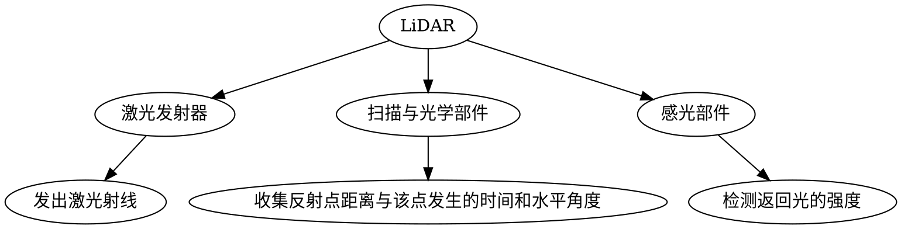

# 光学雷达工作原理
1.向目标物体发射一束激光；
2.根据接收-反射的时间间隔确定目标物体的实际距离；
3.根据距离及激光发射角度，通过简单的几何变化，推导出物体的位置信息
  精准度：厘米级

&#8195;&#8195;LiDAR在使用过程中并非静止不动，而是以一定的角速度匀速转动，在转动的过程中不断地发出激光并收集反射点的信息。
&#8195;&#8195;每个激光发射器都有其编号和固定的垂直角度，根据这些数据就可以计算出所有反射点的坐标。
&#8195;&#8195;当LiDAR旋转一周后，所有反射点坐标的集合就形成了点云
