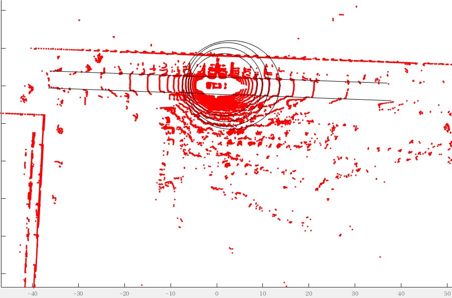
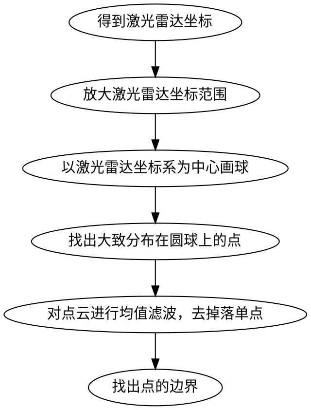
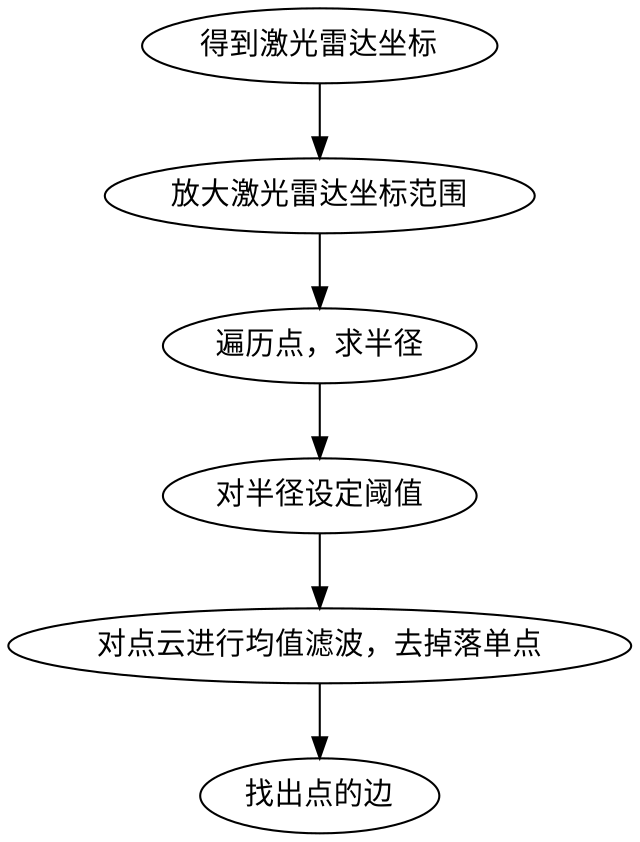

# 分析思路
&#8195;&#8195;要将图片中的马路部分在点云中进行分离，那么便需要对马路的特征进行分析，根据马路的特征对点的坐标进行取舍，进而使用程序将与马路相关的点进行分离；

特征
1. 在直路上马路上的部分点成一条直线；

2. 遇到树直的障碍物，其点云的分布为双股线，但是照射在水平地面上的点云分布，则是以激光雷达为中心的部分圆弧的分布，该分布特征呈现为连续弧线状，近似满足空间中圆的方程，这些圆的中心大多在激光雷达所安装的位置；

3. 点云中的场景在matlab三维坐标系中的分布不一定为固定的，标准的分布，而是随机的，因此在寻找马路模型时，应从点与点之间的关系建立模型入手，而非从标准坐标系建模入手；






圆球上的点整理方案
1. 半径递增寻找点
评价：存在两个困难点
```
○半径递增量不易确定，半径值不易确定；
○每次递增，均会导致对大多数点的遍历运算，浪费运算资源
```
2. 点圆半径再分类
评价：
1次遍历，求出所有点与激光雷达坐标系的距离，再对半径设定阈值
