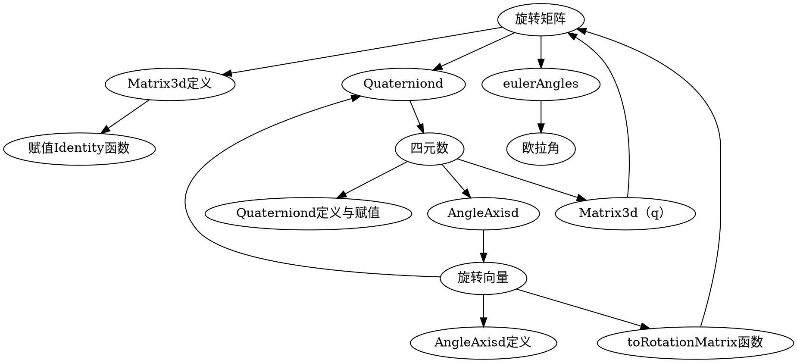

```dot
digraph{
  旋转矩阵 -> Matrix3d定义 -> 赋值Identity函数

  旋转矩阵 -> Quaterniond -> 四元数

  旋转矩阵 -> eulerAngles -> 欧拉角

  旋转向量 -> AngleAxisd定义

  旋转向量 -> toRotationMatrix函数 -> 旋转矩阵

  旋转向量 -> Quaterniond

  四元数 -> Quaterniond定义与赋值

  四元数 -> Matrix3d（q） -> 旋转矩阵

  四元数 -> AngleAxisd -> 旋转向量
}
```
